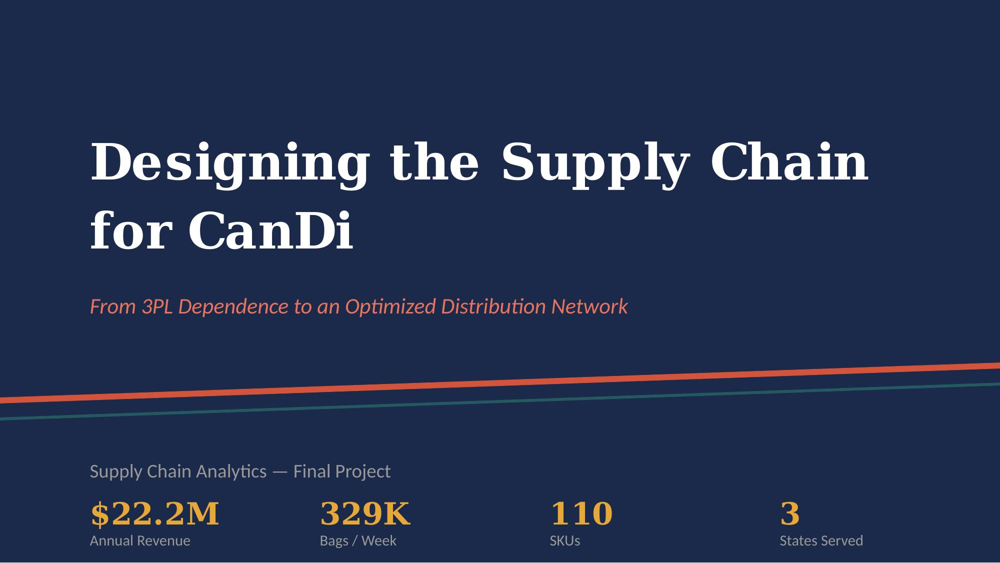
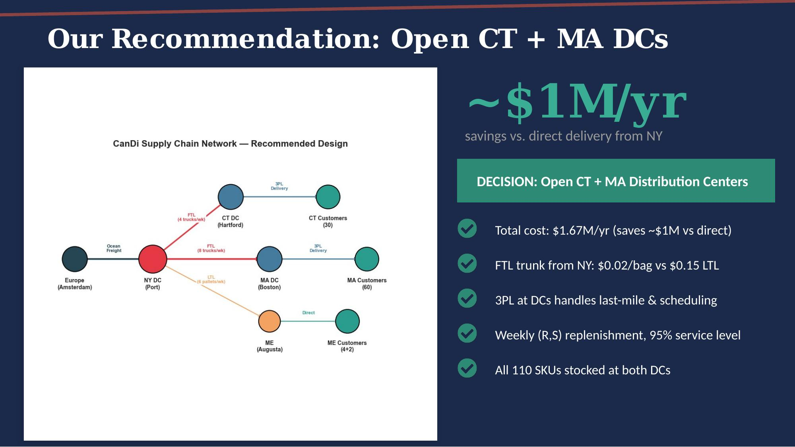
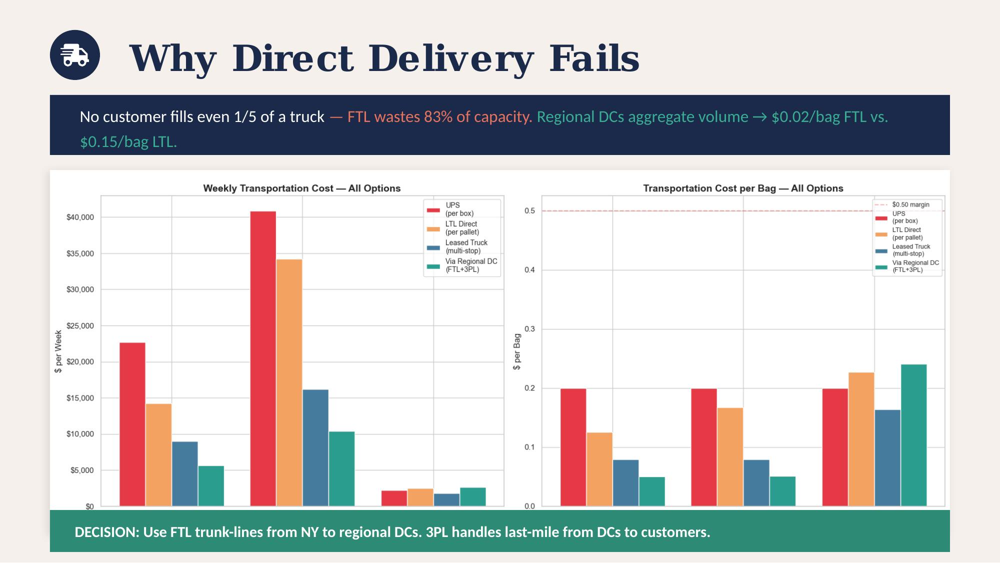
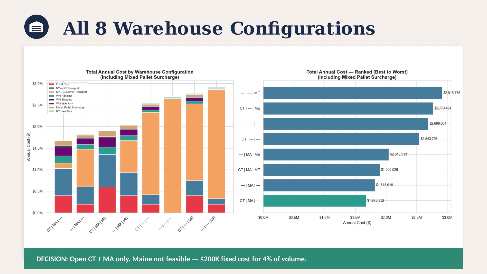
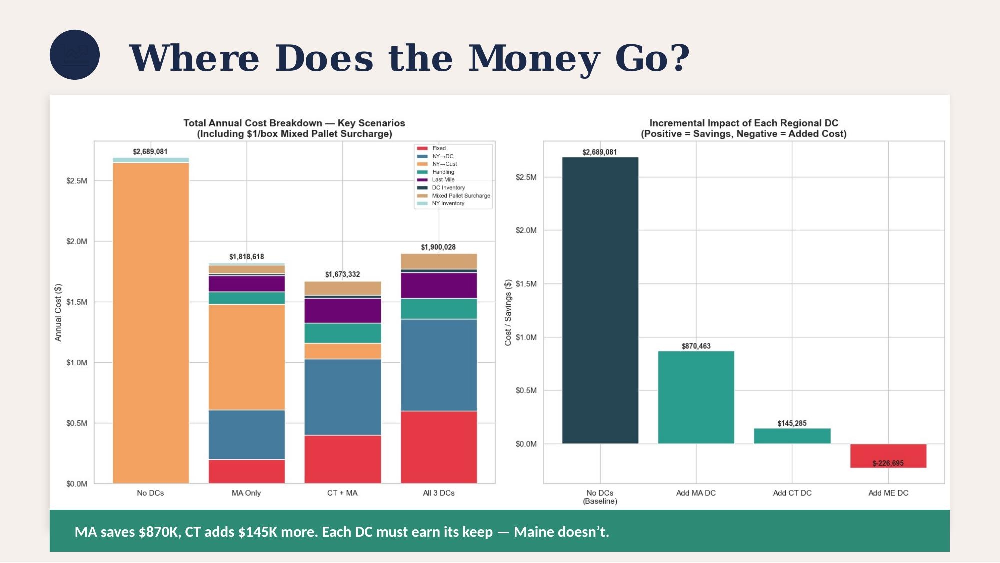
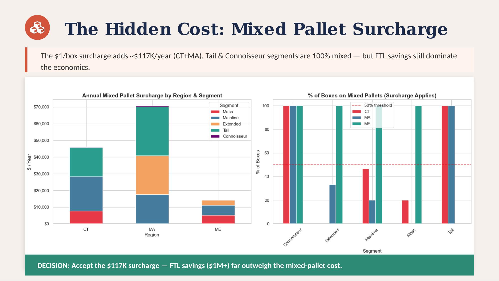
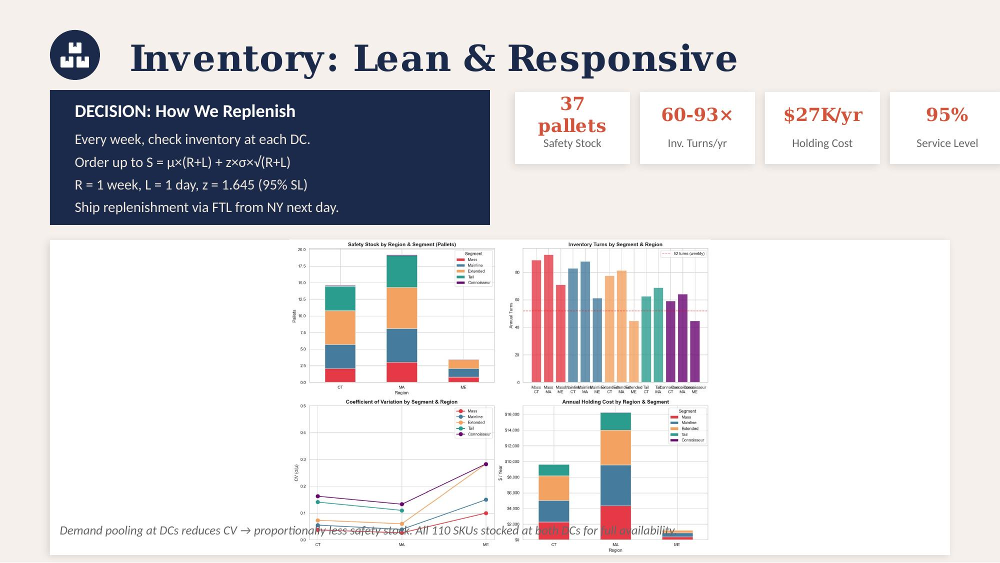

# CanDi Supply Chain Network Design

> **Supply Chain Analytics — Final Project**
> University of Miami, Herbert Business School

## Overview

CanDi (CandyDistributor) is a private equity-backed company that distributes European soft candies across the New England states (Connecticut, Massachusetts, and Maine). After 2 years relying on expensive 3PL distributors, CanDi needs to design its own supply chain infrastructure — deciding where to place distribution centers, how to transport product, and how to manage inventory.

This project delivers a complete supply chain design: structural network decisions, transportation mode selection, and detailed inventory replenishment parameters.

## Presentation

### Slide 1 — Title

### Slide 2 — Recommendation: Open CT + MA DCs

**Decision:** Open distribution centers in Connecticut (Hartford) and Massachusetts (Boston), saving ~$1M/year versus direct delivery from New York. All 110 SKUs stocked at both DCs with weekly (R,S) replenishment at 95% service level.

### Slide 3 — The CanDi Challenge

The three key constraints shaping this problem: FTL trucks are point-to-point (max customer fills only 17% of a truck), each DC costs $200K/year, and mixed pallets incur a $1/box surcharge. Massachusetts dominates demand at 63% of total volume.

### Slide 4 — Why Direct Delivery Fails

**Decision:** Use FTL trunk-lines from NY to regional DCs ($0.02/bag), with the 3PL handling last-mile delivery. LTL direct costs $0.15/bag — 7.5× more expensive.

### Slide 5 — All 8 Warehouse Configurations

**Decision:** Open CT + MA only. We evaluated all 2³ = 8 possible combinations. CT+MA wins at $1.67M/year. Maine is not feasible — $200K fixed cost for only 4% of volume.

### Slide 6 — Where Does the Money Go?

MA saves $870K (handles 63% of volume), CT adds another $145K in savings. Each DC must earn its keep — Maine doesn't.

### Slide 7 — The Hidden Cost: Mixed Pallet Surcharge

**Decision:** Accept the $117K/year surcharge. Tail and Connoisseur segments are 100% mixed pallets, but FTL savings ($1M+) far outweigh the mixed-pallet cost.

### Slide 8 — Inventory: Lean & Responsive

**Decision — How We Replenish:** Every week, check inventory at each DC. Order up to S = μ×(R+L) + z×σ×√(R+L). R = 1 week, L = 1 day, z = 1.645 (95% SL). Ship replenishment via FTL from NY next day. Total safety stock: 37 pallets ($27K/year holding cost). Inventory turns: 60–93× per year.

## Key Results

| Metric | Value |
|--------|-------|
| Annual Revenue | $22.2M |
| Weekly Volume | 329K bags / 274 pallets |
| SKUs | 110 across 5 segments |
| Recommended Config | CT + MA DCs |
| Total Annual Cost | $1.67M |
| Savings vs. Direct | ~$1M/year |
| Safety Stock | 37 pallets |
| Service Level | 95% |

## Methodology

1. **Demand Aggregation** — Computed weekly demand per state by segment, converted bags → boxes → pallets
2. **Transportation Analysis** — Compared FTL, LTL, leased truck, and UPS/FedEx across all routes
3. **Warehouse Enumeration** — Evaluated all 2³ = 8 combinations of CT, MA, ME distribution centers
4. **Cost Breakdown** — Decomposed total cost into trunk transport, last-mile, fixed DC costs, surcharges, and inventory holding
5. **Surcharge Analysis** — Modeled the $1/box mixed-pallet fee by product segment and region
6. **Inventory Design** — Applied Periodic Review (R,S) policy with demand pooling at DCs using safety stock formula SS = z × σ × √(R+L)

## Key Assumptions

- Normally distributed demand (per case instructions)
- All customers in a region behave identically for any given SKU
- All SKUs within a segment have identical characteristics
- Stationary demand (market has stabilized)
- 20 pallets max per truck, no stacking
- $200K/year fixed cost per leased DC
- 25% annual holding cost rate on $0.80/bag product cost
- 95% service level (z = 1.645)
- R = 1 week review period, L = 1 day lead time

## Repository Contents

| File | Description |
|------|-------------|
| `CanDi_Supply_Chain_Analysis.ipynb` | Full Jupyter notebook — demand aggregation, transportation modeling, warehouse evaluation, surcharge analysis, inventory policy design |
| `CanDi_Supply_Chain_Presentation.pptx` | 8-slide executive presentation for CanDi management |
| `CanDi_Supply_Chain_Presentation.pdf` | PDF export of the presentation |
| `docs/` | Slide screenshots used in this README |

## Tools & Libraries

- **Python**: pandas, numpy, matplotlib, seaborn, scipy
- **Presentation**: PptxGenJS (Node.js)

## License

This project is released under the [MIT License](LICENSE).

---

*Daniel Regalado Cardoso — University of Miami, 2026*
