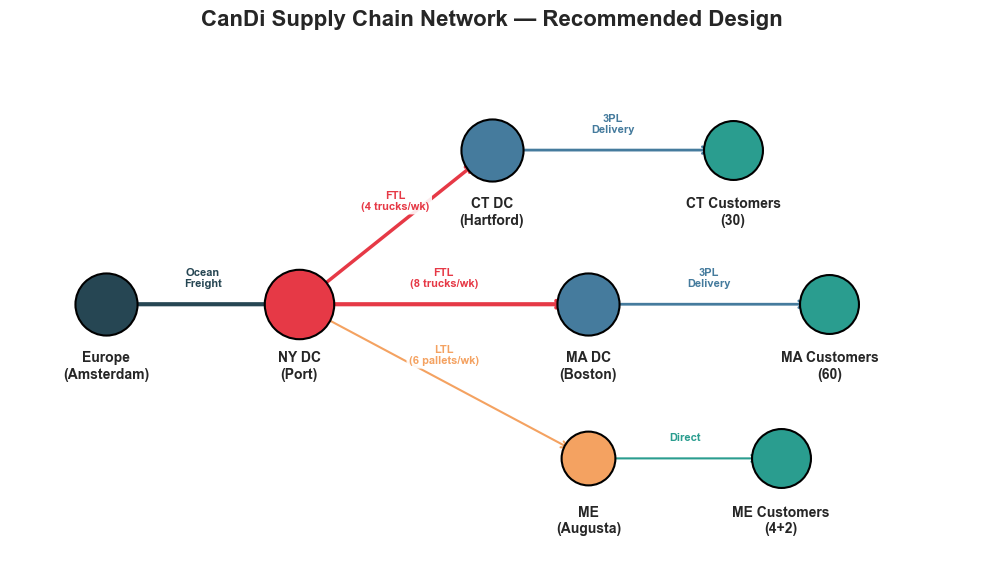
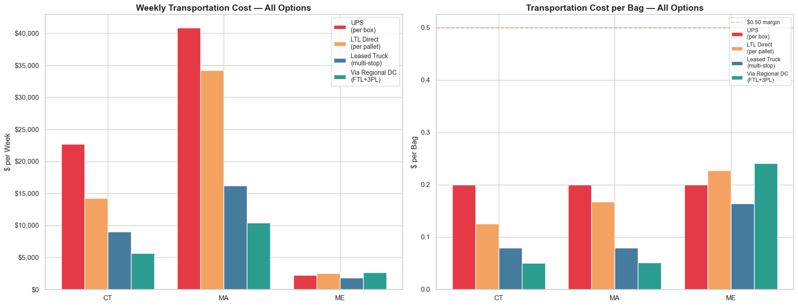
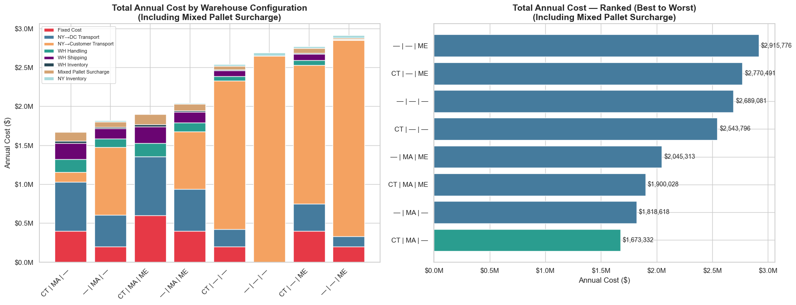
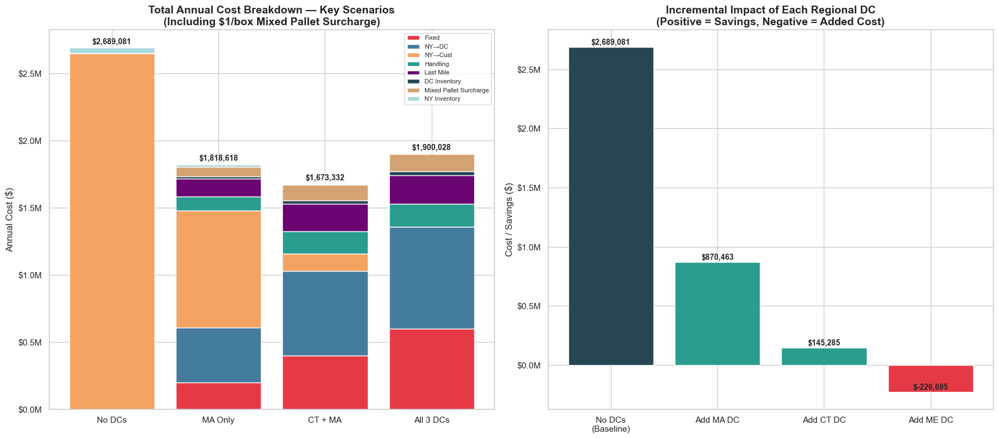
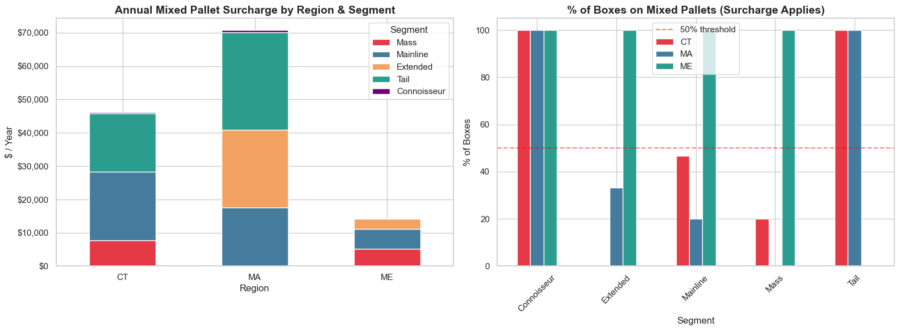
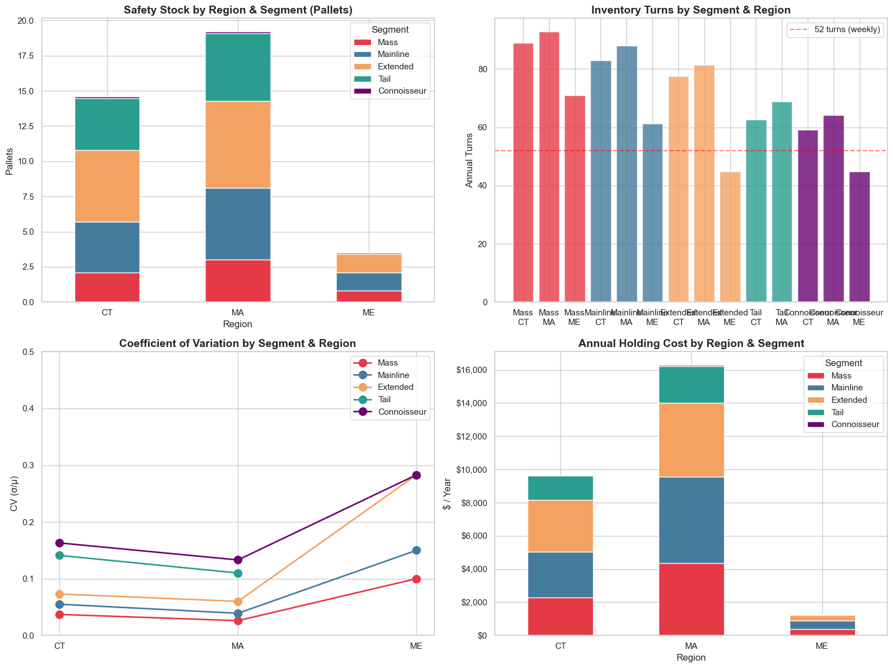

# CanDi Supply Chain Network Design

> **Supply Chain Analytics — Final Project**
> University of Miami, Herbert Business School

## Overview

CanDi (CandyDistributor) is a private equity-backed company distributing European soft candies across New England. After 2 years relying on expensive 3PL distributors, CanDi needs its own supply chain — deciding where to open distribution centers, how to transport product, and how to manage inventory.

This project delivers a complete network design with structural decisions, transportation mode selection, and inventory replenishment parameters, all backed by quantitative analysis.

## Recommended Network

**Decision:** Open two regional DCs — Connecticut (Hartford) and Massachusetts (Boston) — fed by FTL trunk-lines from the NY port hub. The 3PL at each leased DC handles last-mile delivery to customer DCs. Maine is excluded: the $200K/year fixed cost is not justified for only 4% of total volume.

| Metric | Value |
|--------|-------|
| Total Annual Cost | **$1.67M** |
| Savings vs. Direct Delivery | **~$1M/year** |
| Transportation Mode | FTL trunk ($0.02/bag) + 3PL last-mile |
| SKUs Stocked | All 110 at both DCs |
| Replenishment | Weekly Periodic Review (R,S), 95% SL |

## Analysis

### Transportation: Why Direct Delivery Fails

No single customer fills even 1/5 of a truck — FTL direct wastes 83% of capacity. Regional DCs aggregate volume, enabling FTL trunk-lines at $0.02/bag versus $0.15/bag for LTL direct.

### Warehouse Configuration: All 8 Evaluated

We evaluated all 2³ = 8 combinations of the three candidate DC locations. CT + MA is the clear winner. Adding Maine increases total cost by $227K due to the high fixed cost relative to its tiny volume.

### Cost Anatomy: Where Does the Money Go?

MA saves $870K by handling 63% of total volume. CT adds another $145K in savings. Each DC must earn its keep — Maine doesn't.

### Mixed Pallet Surcharge

The $1/box surcharge on mixed pallets adds ~$117K/year. Tail and Connoisseur segments are 100% mixed due to low per-SKU volume, but FTL savings ($1M+) far outweigh this cost.

### Inventory Policy

Periodic Review (R,S) with weekly review cycle. Every week, check inventory at each DC and order up to level S via FTL from NY. Total safety stock: 37 pallets ($27K/year). Demand pooling at DCs reduces the coefficient of variation, requiring proportionally less safety stock.

## Methodology

1. **Demand Aggregation** — Weekly demand per state by segment, converted bags → boxes → pallets
2. **Transportation Analysis** — Compared FTL, LTL, leased truck, and UPS/FedEx across all routes
3. **Warehouse Enumeration** — All 2³ = 8 combinations of CT, MA, ME evaluated on total annual cost
4. **Cost Decomposition** — Trunk transport, last-mile, fixed DC costs, surcharges, and inventory holding
5. **Surcharge Modeling** — $1/box mixed-pallet fee by product segment and region
6. **Inventory Design** — Periodic Review (R,S) with demand pooling; SS = z × σ × √(R+L)

## Key Assumptions

- Normally distributed demand; all customers in a region behave identically per SKU
- All SKUs within a segment have identical characteristics
- Stationary demand (market has stabilized)
- 20 pallets max per truck, no stacking
- $200K/year fixed cost per leased DC
- 25% annual holding cost rate on $0.80/bag product cost
- R = 1 week, L = 1 day, z = 1.645 (95% service level)

## Repository Contents

| File | Description |
|------|-------------|
| `CanDi_Supply_Chain_Analysis.ipynb` | Full Jupyter notebook with all analysis |
| `CanDi_Supply_Chain_Presentation.pptx` | 8-slide executive presentation |
| `CanDi_Supply_Chain_Presentation.pdf` | PDF export of the presentation |
| `docs/` | Chart images from the analysis |

## Tools

Python (pandas, numpy, matplotlib, seaborn, scipy) for analysis. PptxGenJS (Node.js) for the presentation.

## License

[MIT License](LICENSE)

---

*Daniel Regalado Cardoso — University of Miami, 2026*
